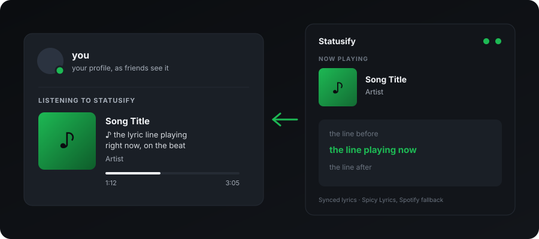

<div align="center">
  
  <h1>Statusify v1.4.0</h1>
  <p><strong>The ultimate Discord Rich Presence & Spotify Lyrics bridge.</strong></p>

  
  
  
  
  [](https://github.com/KurepaBoss/Statusify/actions/workflows/tests.yml)

  
  <br><sub>Illustration: your Discord status shows the lyric line playing right now.</sub>
</div>

---

## 🌟 Overview
**Statusify** is a lightweight, high-performance bridge that connects your Spotify listening experience directly to Discord and your desktop. It offers a beautiful, High-DPI aware GUI to track your session history, view synced lyrics, and manage multiple Discord profiles with a single click.

Lyrics come straight from Spicetify over a local WebSocket — no API keys, no polling a web service, no rate limits. The bridge extension pushes the current track and its exact playback position every 500 ms, and Statusify maps that position to the right lyric line before it reaches Discord.

---

## 🆕 What's New in v1.4.0

**One-click updates.** When a new version is out, *Install update* downloads the new installer, checks it against the SHA-256 published with the release (and refuses to run it if they differ), installs it silently and restarts Statusify. Installs from `Statusify-Setup.exe` only; portable and source copies still get the download link.

**Repair lyrics from the app.** When a Spotify update knocks out the lyrics bridge, the warning under the status dots is now a button: click it and Statusify re-applies Spicetify for you, then clears the warning once Spotify is running the current bridge.

**Lyrics right after Spotify starts.** Songs that fall back to Spotify's own lyrics used to get none if played in the first ~20 seconds after Spotify opened: Spotify's internal request router isn't ready yet and the bridge gave up. It now waits for it.

**No more admin.** Hotkeys don't need Statusify to run elevated any more (since v1.3.0), so nothing about Statusify asks for administrator rights.

**Under the hood.** Tests run on every push, the Discord connection code lives in its own module, and releases are ready for code signing (see [SIGNING.md](SIGNING.md)).

---

## 🆕 What's New in v1.3.0

**One-click installer.** Download `Statusify-Setup-1.3.0.exe` from the [Releases page](https://github.com/KurepaBoss/Statusify/releases) and it handles everything: installs Statusify, installs [Spicetify](https://spicetify.app/) if you don't have it, wires the lyrics bridge into Spotify and applies it. No terminal, no copying files. It also adds a **Repair Spicetify bridge** shortcut to the Start Menu for when a Spotify update wipes Spicetify.

**Hotkeys work in games, without admin.** Hotkeys now use Windows' own `RegisterHotKey` instead of a keyboard hook. The old hook went deaf whenever a game had focus unless Statusify ran as administrator, and fired on every key-repeat, so holding `Ctrl+Alt+N` a moment too long skipped a whole run of tracks. Now one press is one action, and a combo already taken by another program is reported instead of silently doing nothing.

**Lyrics no longer leak between songs.** Skipping while lyrics were still loading could put the *previous* song's lyrics on your status. Lyrics are now matched to their exact track. A lyric-less track also no longer inherits the previous song's instrumental breaks, and the bridge no longer fetches every track twice on connect.

**Smoother lyric timing.** Lines are grouped by how much song they cover, so each Discord update lasts long enough to stay inside Discord's rate limit (5 updates per 20 s). Playback position is interpolated between the bridge's position pings, so lines advance on time instead of in jumps.

**Shows alongside games.** Your presence is now a *Listening* activity, the same slot Spotify uses, so a running game no longer hides your music.

**Spicy Lyrics 6.x support**, a faster and tidier Settings page (collapsible sections, auto-save, no more SAVE buttons), and the scroll-restore crash is fixed.

---

## 🆕 What's New in v1.2.0

**A fully redesigned interface.** The GUI now runs on a real animation engine — eased fades and transitions, smooth scrolling, hover and focus states on every control, and rounded album art. Accent colours are blended and contrast-checked at runtime, so text stays readable against whatever accent you pick, in both light and dark themes.

**No more zombie processes.** Closing Statusify could leave `pythonw.exe` running with no window, still holding the single-instance lock and port 8765 — so the next launch refused to start and Task Manager was the only way out. Shutdown now closes the Discord pipe first to unblock stuck reader threads, then exits without waiting on them.

**Launching a second copy now shows the first one.** Previously it just exited silently and looked like nothing had happened. It now brings the running window to the front, and tells you plainly if the running copy is wedged instead of leaving you guessing.

**Stale-bridge detection.** Statusify compares the bridge extension in your Spicetify folder against the copy actually injected into Spotify and warns you when they differ — the situation that used to look like "lyrics randomly stopped working." See [step 2 of the setup](#2-prepare-spicetify-for-lyrics) for why restarting Spotify never fixed it.

**Better diagnostics.** Every log line, including everything from the Spicetify bridge, now lands in a timestamped `statusify.log` next to `main.py` — so "presence stopped working an hour ago" is answerable after the fact. The file is size-capped, and crashes are captured too, even under `pythonw.exe`, which has no console for stderr to go to.

---

## ✨ Key Features

**Presence & lyrics**
- 🎤 **Synced lyrics** on your Discord status, driven by Spicetify's exact playback position.
- 🎸 **Instrumental handling** — detects instrumental gaps and shows your own custom text instead of a blank line.
- ⏸️ **Paused indicator** — optionally keep a "Paused" status instead of clearing your presence.
- 🖼️ **Album art** on the presence, with a local disk cache so the same track never re-downloads.
- ⏱️ **Lyric timing offset** — a global delay slider, plus a per-track offset that is remembered for songs whose lyrics are permanently early or late.

**The app itself**
- 🚀 **Zero-config startup** — a setup wizard on first run and self-installing dependencies.
- 📂 **Session history** — a searchable database of everything you've listened to; filter by song, artist, or even lyric content, and export any track's lyrics as a timestamped `.lrc` or plain `.txt`.
- 🎭 **Multi-profile support** — manage multiple Discord Application IDs and switch between them instantly.
- 🪟 **Mini mode** — collapse to a compact, always-visible bar.
- 🔔 **System tray** — close-to-tray, so Statusify keeps running out of the way.
- 🎨 **Themes** — smooth dark and light modes with custom accent colours.
- ⌨️ **Global hotkeys** for toggling RPC, skipping the current track, and skipping instrumentals.
- 🚫 **Blacklist** — case-insensitive terms matched against artist and title, so anything you'd rather not broadcast never reaches Discord.
- 📊 **Session stats** — songs played and total listening time.
- ⚙️ **Start with Windows**, optionally minimised.
- 🔄 **Update checker** — reads the repo's releases in the background and shows you the changelog for anything newer.
- 🖥️ **Retina-ready UI** — native High-DPI support for crystal-clear text on any Windows scaling mode.

---

## ⬇️ Download

<div align="center">

### **[Download Statusify.exe](https://github.com/KurepaBoss/Statusify/releases/latest)**

</div>

One file, no Python required — Python and every dependency are compiled in. Put it in a folder you intend to keep (it stores your settings, history and logs beside itself), then double-click it.

> **Windows will warn you the first time.** The exe is unsigned, so SmartScreen shows "Windows protected your PC" → **More info** → **Run anyway**. Each release publishes a `Statusify.exe.sha256` you can check against `Get-FileHash Statusify.exe -Algorithm SHA256` if you want to confirm the download is byte-for-byte what the build workflow produced. Some antivirus engines also flag it, because Statusify registers a global keyboard hook (for the hotkeys) and opens a local socket (for the Spicetify bridge) — both visible in the source above.

Prefer running from source? That's the next section, and it's still the better option if you want to modify anything.

---

## 🚀 Easy Setup

You need the **regular desktop Spotify** from [spotify.com](https://www.spotify.com/download/windows/). The Microsoft Store version can't be modified by Spicetify, so lyrics won't work with it. Open Spotify once and log in before installing.

### 1. Run the installer
Download **`Statusify-Setup-<version>.exe`** from the [latest release](https://github.com/KurepaBoss/Statusify/releases/latest) and run it. No administrator rights needed; it installs just for you.

> Windows SmartScreen may say *"Windows protected your PC"* because the installer isn't code-signed. Click **More info → Run anyway**. Each release lists a SHA-256 checksum if you want to verify the download.

Keep **"Install Spicetify and the lyrics bridge"** ticked. A console window shows progress while it sets up Spicetify, and Spotify restarts once at the end.

### 2. Enter your Discord Application ID
The installer asks for it (you can also skip and Statusify asks on first launch):
1. Go to the [Discord Developer Portal](https://discord.com/developers/applications) and click **New Application**.
2. Name it what you want your status to show, e.g. **Spotify**.
3. Copy the **Application ID** from *General Information* and paste it in.

### 3. Play something
Launch Statusify, play a song, and your status shows the track and synced lyrics.

### If lyrics stop after a Spotify update
Spotify updates remove Spicetify's changes. Run **Start Menu → Statusify → Repair Spicetify bridge**. Statusify also warns you when the bridge inside Spotify is out of date.

<details>
<summary><b>Running from source instead</b></summary>

1. Install [Python 3.10+](https://www.python.org/downloads/) and [Spicetify](https://spicetify.app/docs/getting-started).
2. `pip install -r requirements.txt`
3. Set up the bridge: `powershell -ExecutionPolicy Bypass -File installer\setup-spicetify.ps1 -Bridge lyrics-bridge.js`
4. `python main.py` (or `run.vbs` for a windowless start). Copy `.env.example` to `.env` to set the Application ID up front.

</details>

> **Why `spicetify apply` and not just a restart?**
> Spicetify keeps two copies of every extension: the source in
> `%APPDATA%\spicetify\Extensions`, and an injected copy inside Spotify's own
> `xpui` bundle. Spotify only ever runs the injected one, and only
> `spicetify apply` updates it. The installer and the Repair shortcut both do
> this for you and verify the result.

> If Spicy Lyrics has no lyrics for a track, Statusify falls back to Spotify's own lyrics and says so in the log. If neither has lyrics, it still publishes the title, artist and album art, so a lyric problem never means a blank Rich Presence.

---

## ⚙️ Configuration

Your preferences live in `statusify.cfg`, written next to `main.py` — or next to `Statusify.exe` if you're using the release build — and never committed. Everything in it is editable from the Settings tab:

| Setting | Notes |
| --- | --- |
| **Theme** | Dark / light, plus a custom accent colour. |
| **Hotkeys** | Defaults: `Ctrl+Alt+S` toggle RPC, `Ctrl+Alt+N` skip track, `Ctrl+Alt+I` skip instrumental. |
| **Lyric delay** | Global offset in ms, with a per-track override for stubborn songs. |
| **Behaviour** | Close-to-tray, always-on-top, start minimised. |
| **Startup** | Launch Statusify with Windows. |
| **Discord RPC** | Paused indicator, custom instrumental text, profile switching. |
| **History** | Toggle session recording on/off. |

**Files Statusify creates at runtime**, in its own folder (all gitignored):

| File | What it is |
| --- | --- |
| `statusify.cfg` | Your preferences and window geometry. |
| `.env` | Your Discord Application ID. |
| `history.json` | Session history, including stored lyrics. |
| `statusify.log` | Timestamped diagnostic log; rotates to `.old` past 512 KB. |
| `.artcache/` | Cached album art, keyed by URL hash. |
| `exports/` | Lyrics you export as `.lrc` / `.txt`. |

---

## 🧩 How the bridge works

```
Spotify + Spicetify ──[ lyrics-bridge.js ]──► ws://127.0.0.1:8765 ──► main.py ──► Discord RPC
      track + position, every 500 ms                                  the lyric line for this instant
```

`lyrics-bridge.js` is installed into Spicetify for you on launch. See [INSTALL.md](INSTALL.md) if you want to install or debug it by hand.

---

## 🩺 Troubleshooting

**Lyrics or presence stopped working.** Check `statusify.log` first — it sits next to `main.py` and includes every message from the Spicetify bridge, prefixed `[Bridge]`.

**Statusify warns that the bridge is out of date.** Run `spicetify apply`. Restarting Spotify will not help; see the note above.

**My settings and history keep disappearing (exe build).** `Statusify.exe` stores its data in the folder it runs from. Running it straight out of a temp folder, an unzipped-on-the-fly archive, or anywhere Windows cleans up will take your config with it — move the exe somewhere permanent. A read-only location will fail to save for the same reason; `statusify.log` records the write error.

**"Statusify is already running" but there's no window.** Launch it again — the running instance will bring its window to the front. If it tells you the running copy isn't responding, quit it from the system-tray icon and start it again.

**No lyrics on one specific track.** Confirm Spicy Lyrics itself has lyrics for it in Spotify. Statusify falls back to Spotify's own lyrics and logs the fallback; if neither source has them, presence still shows title, artist and album art.

**Verify the bridge is connected.** Open Spotify DevTools (`Ctrl+Shift+I`) and look for `[LyricsBridge] Connected to Python.` in the Console tab.

---

## 🛠️ Development

```bash
pip install -r requirements.txt
pip install pytest
pytest
```

The suite is headless — it stubs out tkinter, Discord and Spotify, so it runs anywhere without a display. `tests/legacy/` holds standalone diagnostic scripts from earlier debugging sessions; they are excluded from collection on purpose (see `pytest.ini`) and are run directly, e.g. `python tests/legacy/test_freeze_fix.py`.

### Building the release executable

```powershell
.\build_exe.ps1        # -> dist\Statusify.exe
```

That creates its own `.buildenv` venv, installs PyInstaller, and runs `Statusify.spec`. Pushing a `v*` tag does the same thing on a clean Windows runner and attaches the exe plus its SHA256 to the GitHub release — see `.github/workflows/release.yml`.

Two notes for anyone touching the packaging:

- **`_APP_DIR` vs `_RES_DIR`.** User data (config, history, logs, caches) resolves from `_APP_DIR`, which points at the folder holding the exe when frozen. Bundled read-only files (`lyrics-bridge.js`, `statusify.ico`) resolve from `_RES_DIR`, which is `sys._MEIPASS`. Mixing them up means either losing every setting on exit or never being able to install the bridge.
- **`upx=False` in the spec is deliberate.** UPX packing is a strong antivirus heuristic trigger, and a global keyboard hook plus a listening socket is already an awkward combination for scanners.

`build_launcher.ps1` is a different, smaller thing: it compiles a 9 KB shim that launches `main.py` with your local `pythonw.exe`, for running from source without a console window.

---

## 🤝 Contributing
Found a bug or have a suggestion? Open an [Issue](https://github.com/KurepaBoss/Statusify/issues) or submit a Pull Request.

## 📄 License
Released under the [MIT License](LICENSE).

**Made with ❤️ by [KurepaBoss](https://github.com/KurepaBoss)**
