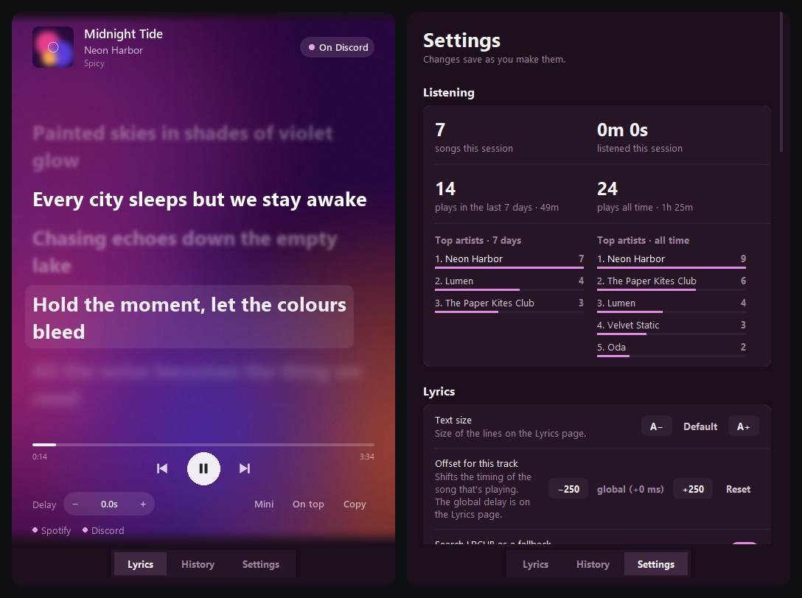

<div align="center">
  
  <h1>Statusify v2.1.0</h1>
  <p><strong>The ultimate Discord Rich Presence & Spotify Lyrics bridge.</strong></p>

  
  
  
  
  [](https://github.com/KurepaBoss/Statusify/actions/workflows/tests.yml)

  
  <br><sub>The lyric sheet takes its colours from the cover. The cover, song and lyrics in this screenshot are made up.</sub>
</div>

---

## 🌟 Overview
**Statusify** is a lightweight, high-performance bridge that connects your Spotify listening experience directly to Discord and your desktop. It offers a beautiful, High-DPI aware GUI to track your session history, view synced lyrics, and manage multiple Discord profiles with a single click.

Lyrics come straight from Spicetify over a local WebSocket — no API keys, no polling a web service, no rate limits. The bridge extension pushes the current track and its exact playback position every 500 ms, and Statusify maps that position to the right lyric line before it reaches Discord.

---

## 🆕 What's New in v2.1.0

**Karaoke lyrics.** When the lyrics have word timing (most Spicy Lyrics tracks do), each word lights up as it's sung, with the word being sung filling from left to right. Instrumental breaks show three breathing dots that fill up over the gap instead of a blank line.

**A desktop lyrics overlay.** A transparent strip that shows the current line (and optionally the next one) on top of anything, including borderless games. Clicks pass straight through it. Unlock it to drag it or scroll to resize, then lock it again. Turn it on with the *Overlay* button, the tray menu, `Ctrl+Alt+O`, or *Settings → Lyrics*.

**A new Stats tab.** Your recently played songs with covers and times, a GitHub-style heatmap of plays per day, your top songs, the listening overview that used to live in Settings, and a monthly *Wrapped* card (top song, top artist, listening time, busiest hour, longest streak) that you can save or copy as an image.

**More control over Spotify.** Shuffle, repeat and like buttons, and volume on the mouse wheel over the play button or speaker icon (click the speaker to mute). *Up Next* shows your queue; click a song to jump to it. Shortcuts: `Ctrl+↑/↓` volume, `Ctrl+S` shuffle, `Ctrl+R` repeat, `Ctrl+L` like.

**Lyrics that are right, and ready.** The next song's lyrics load while the current one plays, so the sheet is never empty at a track change. If a song has the wrong lyrics, *⋯ → Wrong lyrics? Search…* lets you pick the right version from LRCLIB, and your choice is kept for that song.

**Romanised and translated lines.** Under each lyric line, optionally show a romanisation (Japanese, Chinese, Korean, Cyrillic, Greek and more) and/or a translation into your language. Results are cached, so replays work offline. *Settings → Lyrics → Under each line.*

**Share a line.** Right-click any lyric line to copy it or turn it into a 1080×1350 image with the song's colours and cover.

**Fullscreen.** `F11` fills the screen with big lyrics; the controls fade away until you move the mouse.

**A better mini player.** A rounded pill with the cover, the lyric and play controls. It snaps to screen corners and edges and fades when you're not using it. The tray icon's tooltip shows the song and the current line; middle-click it to play or pause.

**Smaller things.** Pick the lyric font and size. The background can pulse gently with the beat when beat data is available. A sleep timer pauses Spotify after 15, 30 or 60 minutes or at the end of the song. The delay stepper now saves timing per song (shift-click for the global delay). Discord shows the album on hover and a *Listen on Spotify* button. If a Spotify update breaks the bridge, Statusify notices and offers a one-click repair. Animations now run at a true 60 fps on *Smooth* (they were capped near 32 by Windows' timer).

**Updating:** the Spotify bridge changed, so it has to be re-applied once. The installer does this for you; if you run from source, click the *Lyrics bridge out of date* message after updating.

Notes for v2.0 and earlier are on the [Releases page](https://github.com/KurepaBoss/Statusify/releases).

---

## ✨ Key Features

**Presence & lyrics**
- 🎤 **Synced lyrics** on your Discord status, driven by Spicetify's exact playback position.
- 🎸 **Instrumental handling** — detects instrumental gaps and shows your own custom text instead of a blank line.
- ⏸️ **Paused indicator** — optionally keep a "Paused" status instead of clearing your presence.
- 🖼️ **Album art** on the presence, with a local disk cache so the same track never re-downloads.
- 📚 **Three lyric sources** — Spicy Lyrics, then Spotify's own, then [LRCLIB](https://lrclib.net); lyrics you've heard before load instantly from a local cache.
- 👥 **Shows the song in the member list** — *Listening to &lt;song&gt;*, with the title linking to the track on Spotify.
- ⏱️ **Lyric timing offset** — a global delay slider, plus a per-track offset that is remembered for songs whose lyrics are permanently early or late.

**The app itself**
- 🌊 **A living lyric sheet** — album colours flowing behind the words, lines that glide, sharpen and fade, word-by-word karaoke highlighting, and optional romanised or translated lines.
- 🪟 **Desktop overlay** — the current lyric floating over any app or game, click-through.
- ⏯️ **Playback controls** — previous, play/pause, next, shuffle, repeat, like, volume, a seek bar, an Up Next queue, and click-a-lyric-line to jump there.
- 🚀 **Zero-config startup** — a setup wizard on first run and self-installing dependencies.
- 📂 **Listening history** — every play saved as it happens, with its date; search everything you've played by song, artist, or even lyric content, and export any track's lyrics as a timestamped `.lrc` or plain `.txt`.
- 🎭 **Multi-profile support** — manage multiple Discord Application IDs and switch between them instantly.
- 💊 **Mini player** — a compact pill with cover, lyric and controls that snaps to screen edges.
- 🔔 **System tray** — close-to-tray, so Statusify keeps running out of the way.
- 🎨 **Themes** — smooth dark and light modes with custom accent colours.
- ⌨️ **Global hotkeys** for toggling RPC, skipping the current track, and skipping instrumentals.
- 🚫 **Blacklist** — case-insensitive terms matched against artist and title, so anything you'd rather not broadcast never reaches Discord.
- 📊 **Stats tab** — recently played, a plays-per-day heatmap, top songs and artists, and a monthly Wrapped card you can save as an image.
- ⚙️ **Start with Windows**, optionally minimised.
- 🔄 **Update checker** — reads the repo's releases in the background and shows you the changelog for anything newer.
- 🖥️ **Retina-ready UI** — native High-DPI support for crystal-clear text on any Windows scaling mode.

---

## ⬇️ Download

<div align="center">

### **[Download Statusify-Setup.exe](https://github.com/KurepaBoss/Statusify/releases/latest)**

</div>

The installer is the recommended download: it installs Statusify, sets up Spicetify and the lyrics bridge, and enables one-click updates. See [Easy Setup](#-easy-setup) below.

A portable `Statusify.exe` is on the same release page if you'd rather not install anything — one file with Python and every dependency compiled in. Put it in a folder you intend to keep (it stores your settings, history and logs beside itself), then double-click it. You'll need to set up Spicetify yourself (see [INSTALL.md](INSTALL.md)).

> **Windows will warn you the first time.** The exe is unsigned, so SmartScreen shows "Windows protected your PC" → **More info** → **Run anyway**. Each release publishes a `.sha256` file for every exe you can check against `Get-FileHash <file> -Algorithm SHA256` if you want to confirm the download is byte-for-byte what the build workflow produced. Some antivirus engines also flag it, because Statusify registers global hotkeys and opens a local socket (for the Spicetify bridge) — both visible in the source above.

Prefer running from source? That's the next section, and it's still the better option if you want to modify anything.

---

## 🚀 Easy Setup

You need the **regular desktop Spotify** from [spotify.com](https://www.spotify.com/download/windows/). The Microsoft Store version can't be modified by Spicetify, so lyrics won't work with it. Open Spotify once and log in before installing.

### 1. Run the installer
Download **`Statusify-Setup-<version>.exe`** from the [latest release](https://github.com/KurepaBoss/Statusify/releases/latest) and run it. No administrator rights needed; it installs just for you.

> Windows SmartScreen may say *"Windows protected your PC"* because the installer isn't code-signed. Click **More info → Run anyway**. Each release lists a SHA-256 checksum if you want to verify the download.

Keep **"Install Spicetify and the lyrics bridge"** ticked. A console window shows progress while it sets up Spicetify, and Spotify restarts once at the end.

### 2. Enter your Discord Application ID
The installer asks for it (you can also skip and Statusify asks on first launch):
1. Go to the [Discord Developer Portal](https://discord.com/developers/applications) and click **New Application**.
2. Name it what you want your status to show, e.g. **Spotify**.
3. Copy the **Application ID** from *General Information* and paste it in.

### 3. Play something
Launch Statusify, play a song, and your status shows the track and synced lyrics.

### If lyrics stop after a Spotify update
Spotify updates remove Spicetify's changes. Run **Start Menu → Statusify → Repair Spicetify bridge**. Statusify also warns you when the bridge inside Spotify is out of date.

<details>
<summary><b>Running from source instead</b></summary>

1. Install [Python 3.10+](https://www.python.org/downloads/) and [Spicetify](https://spicetify.app/docs/getting-started).
2. `pip install -r requirements.txt`
3. Set up the bridge: `powershell -ExecutionPolicy Bypass -File installer\setup-spicetify.ps1 -Bridge lyrics-bridge.js`
4. `python main.py` (or `run.vbs` for a windowless start). Copy `.env.example` to `.env` to set the Application ID up front.

</details>

> **Why `spicetify apply` and not just a restart?**
> Spicetify keeps two copies of every extension: the source in
> `%APPDATA%\spicetify\Extensions`, and an injected copy inside Spotify's own
> `xpui` bundle. Spotify only ever runs the injected one, and only
> `spicetify apply` updates it. The installer and the Repair shortcut both do
> this for you and verify the result.

> If Spicy Lyrics has no lyrics for a track, Statusify falls back to Spotify's own lyrics, then to LRCLIB, and says which in the log. If none of them has lyrics, it still publishes the title, artist and album art, so a lyric problem never means a blank Rich Presence.

---

## ⚙️ Configuration

Your preferences live in `statusify.cfg`, written next to `main.py` — or next to `Statusify.exe` if you're using the release build — and never committed. Everything in it is editable from the Settings tab:

| Setting | Notes |
| --- | --- |
| **Theme** | Dark / light, plus a custom accent colour. |
| **Hotkeys** | Defaults: `Ctrl+Alt+S` toggle RPC, `Ctrl+Alt+N` skip track, `Ctrl+Alt+I` skip instrumental, `Ctrl+Alt+O` desktop overlay. |
| **Lyric delay** | Global offset in ms, with a per-track override for stubborn songs. |
| **Behaviour** | Close-to-tray, always-on-top, start minimised. |
| **Startup** | Launch Statusify with Windows. |
| **Discord RPC** | Paused indicator, custom instrumental text, profile switching, song vs app name in the member list, Spotify link, LRCLIB fallback. |
| **History** | Toggle history on/off. Turning it off deletes what's recorded when you quit. |

**Files Statusify creates at runtime**, in its own folder (all gitignored):

| File | What it is |
| --- | --- |
| `statusify.cfg` | Your preferences and window geometry. |
| `.env` | Your Discord Application ID. |
| `history.db` | Listening history, the lyrics cache and lyrics you picked by hand (SQLite). A legacy `history.json` is imported once and renamed `history.json.migrated`. |
| `translations.db` | Cached romanisations and translations of lyric lines. |
| `statusify.log` | Timestamped diagnostic log; rotates to `.old` past 512 KB. |
| `.artcache/` | Cached album art, keyed by URL hash. |
| `exports/` | Lyrics you export as `.lrc` / `.txt`. |

---

## 🧩 How the bridge works

```
Spotify + Spicetify ──[ lyrics-bridge.js ]──► ws://127.0.0.1:8765 ──► main.py ──► Discord RPC
      track + position, every 500 ms                                  the lyric line for this instant
```

`lyrics-bridge.js` is installed into Spicetify for you on launch. See [INSTALL.md](INSTALL.md) if you want to install or debug it by hand.

---

## 🩺 Troubleshooting

**Lyrics or presence stopped working.** Check `statusify.log` first — it sits next to `main.py` and includes every message from the Spicetify bridge, prefixed `[Bridge]`.

**Statusify warns that the bridge is out of date.** Run `spicetify apply`. Restarting Spotify will not help; see the note above.

**My settings and history keep disappearing (exe build).** `Statusify.exe` stores its data in the folder it runs from. Running it straight out of a temp folder, an unzipped-on-the-fly archive, or anywhere Windows cleans up will take your config with it — move the exe somewhere permanent. A read-only location will fail to save for the same reason; `statusify.log` records the write error.

**"Statusify is already running" but there's no window.** Launch it again — the running instance will bring its window to the front. If it tells you the running copy isn't responding, quit it from the system-tray icon and start it again.

**No lyrics on one specific track.** Confirm Spicy Lyrics itself has lyrics for it in Spotify. Statusify then tries Spotify's own lyrics and LRCLIB, and logs each fallback; if no source has them, presence still shows title, artist and album art.

**Verify the bridge is connected.** Open Spotify DevTools (`Ctrl+Shift+I`) and look for `[LyricsBridge] Connected to Python.` in the Console tab.

---

## 🛠️ Development

```bash
pip install -r requirements.txt
pip install pytest
pytest
```

The suite stubs out Discord, Spotify and the network, so it needs neither running, but it does need Windows (named pipes, the registry and live hotkey registration). `tests/test_gui_smoke.py` builds the real window and every page, so it also needs a desktop session. Tests never touch your real data: `tests/conftest.py` points `STATUSIFY_DATA_DIR` at a temp folder, and the same variable works for running a throwaway copy of the app. CI runs the suite on every push.

### Building the release executable

```powershell
.\build_exe.ps1        # -> dist\Statusify.exe
```

That creates its own `.buildenv` venv, installs PyInstaller, and runs `Statusify.spec`. Pushing a `v*` tag does the same thing on a clean Windows runner and attaches the exe plus its SHA256 to the GitHub release — see `.github/workflows/release.yml`.

Two notes for anyone touching the packaging:

- **`_APP_DIR` vs `_RES_DIR`.** User data (config, history, logs, caches) resolves from `_APP_DIR`, which points at the folder holding the exe when frozen. Bundled read-only files (`lyrics-bridge.js`, `statusify.ico`) resolve from `_RES_DIR`, which is `sys._MEIPASS`. Mixing them up means either losing every setting on exit or never being able to install the bridge.
- **`upx=False` in the spec is deliberate.** UPX packing is a strong antivirus heuristic trigger, and global hotkeys plus a listening socket is already an awkward combination for scanners.

`build_launcher.ps1` is a different, smaller thing: it compiles a 9 KB shim that launches `main.py` with your local `pythonw.exe`, for running from source without a console window.

---

## 🤝 Contributing
Found a bug or have a suggestion? Open an [Issue](https://github.com/KurepaBoss/Statusify/issues) or submit a Pull Request.

## 📄 License
Released under the [MIT License](LICENSE).

**Made with ❤️ by [KurepaBoss](https://github.com/KurepaBoss)**
