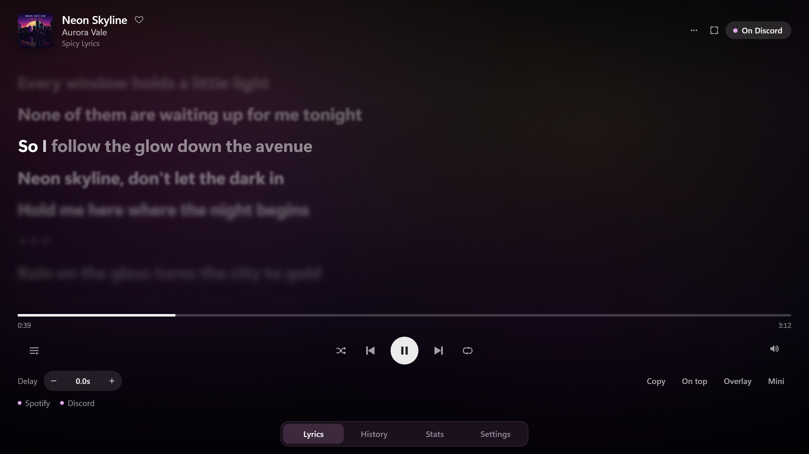
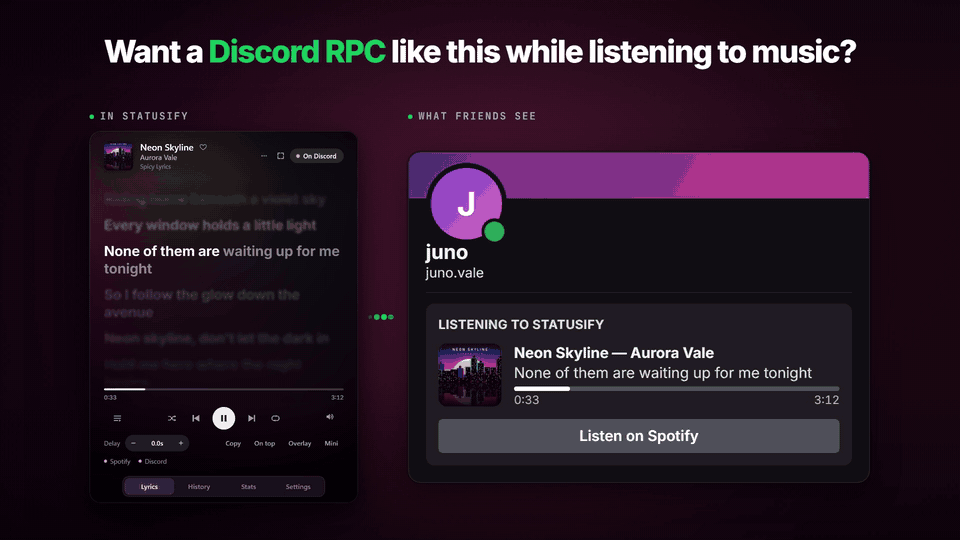
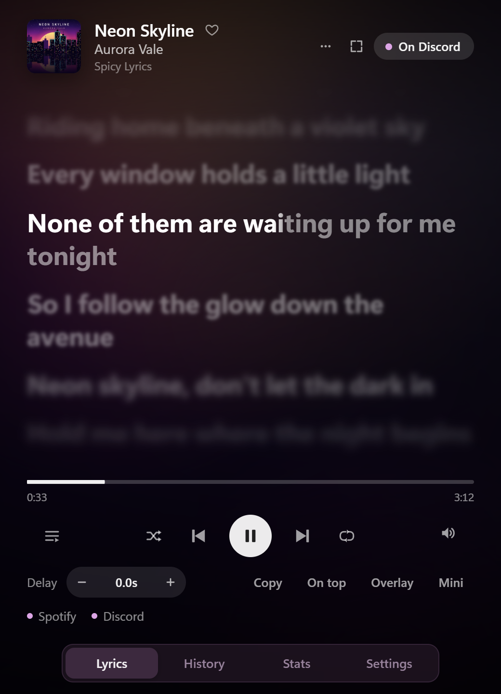
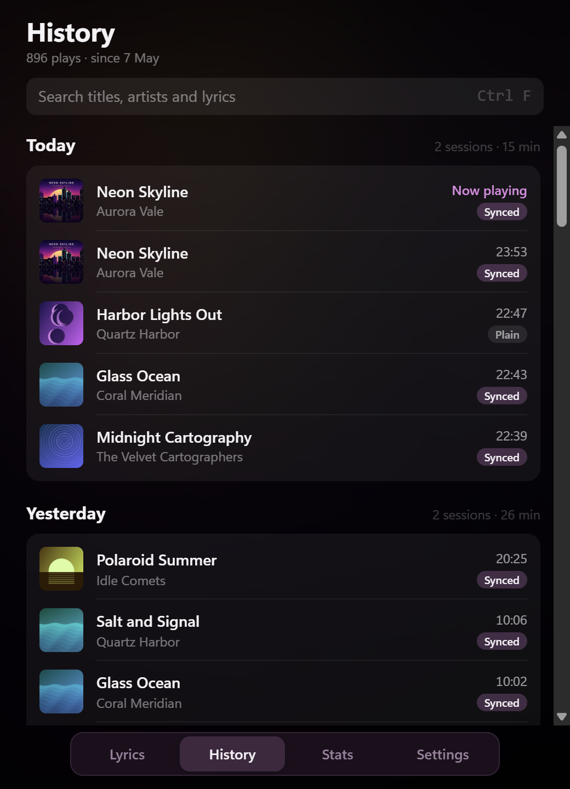
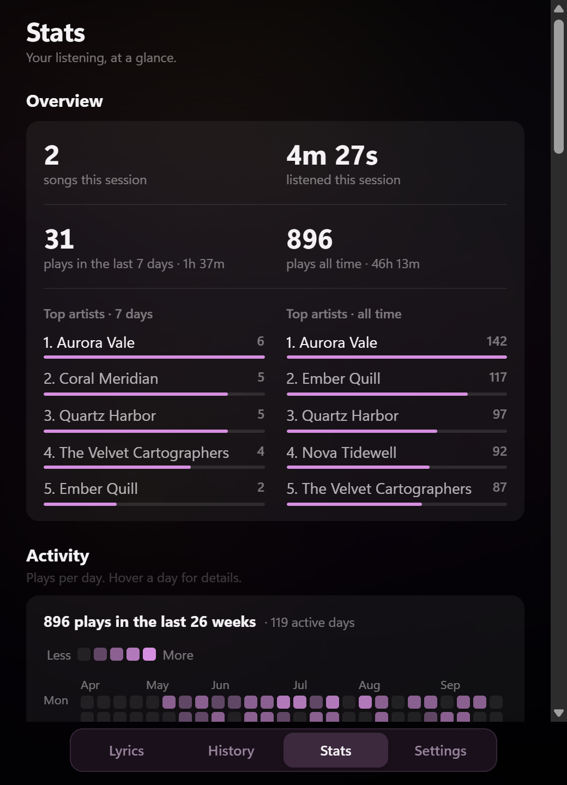
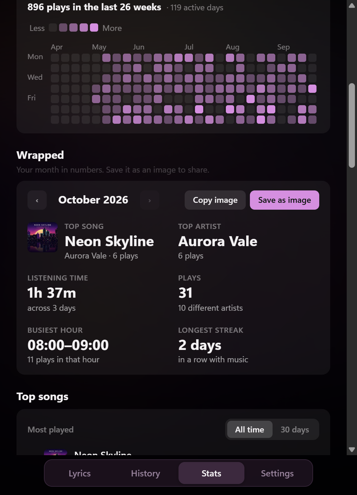
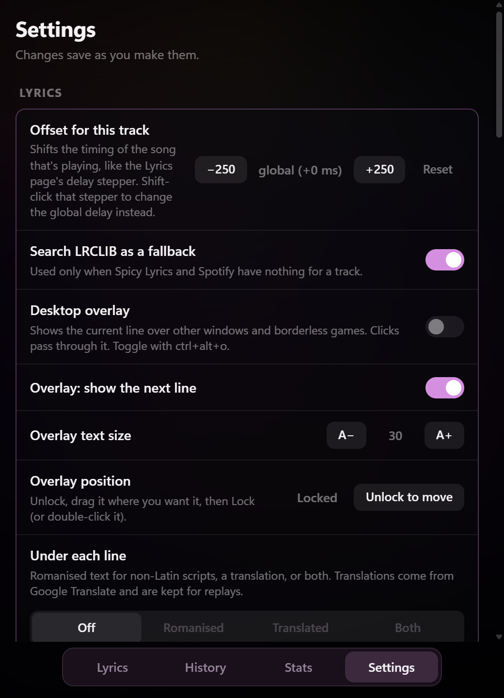
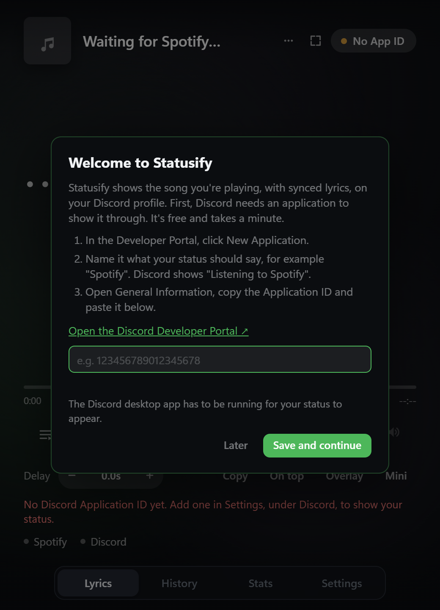

<div align="center">
  
  <h1>Statusify v3.0.0</h1>
  <p><strong>Synced Spotify lyrics on your Discord status. Free and open source, for Windows.</strong></p>

  
  
  
  [](https://github.com/KurepaBoss/Statusify/actions/workflows/tests.yml)

  
  <br><sub>The cover, song and lyrics in the screenshots are fictional.</sub>
  <br><br>
  <a href="https://github.com/KurepaBoss/Statusify/releases/latest"></a>
  <br><sub>Synced lyrics on your Discord status, and the install in three steps. All demo content is fictional.</sub>
  <br><sub>Low frame rate? <a href="docs/statusify-promo.mp4">Watch the demo as a 30 fps video with sound</a>.</sub>
</div>

---

## 🌟 Overview
**Statusify** shows what you're listening to on Spotify as your Discord status, with the lyric being sung right now, and gives you a lyrics window, a listening history and a few stats on the desktop.

Spotify itself supplies the song and its exact playback position: a small extension (the *bridge*) runs inside Spotify through [Spicetify](https://spicetify.app) and talks to Statusify over a local WebSocket. Statusify maps the position to the right lyric line and hands it to the Discord desktop app over Discord's local Rich Presence pipe. Nothing goes through a Statusify server, because there isn't one, and you don't need an API key.

Version 3 is a rewrite in Rust and [Tauri](https://tauri.app). It replaces the Python app that versions 1 and 2 were built on.

---

## 🆕 What's New in v3.0.0

**Rewritten in Rust and Tauri.** The Python app is retired and stays on the [python-legacy branch](https://github.com/KurepaBoss/Statusify/tree/python-legacy). The window now runs on the system's WebView2 with GPU-composited animation instead of a canvas redrawn in software, so the interface is much faster and the whole app is roughly 10-12 MB.

**A faster, steadier Spotify to Discord bridge.** The chain from Statusify hearing about a change to the update reaching Discord was timed on the development PC, with a stand-in for Spotify and one for Discord's pipe, so Discord's own delay is not in these numbers. They compare against the first build of version 3; the Python app was not measured. Median times unless noted:

- **Changes in Statusify itself, nothing else needed.** The first status update after a song change arrives 0.45 s later when the lyrics were fetched ahead (it was 1.57 s) and 0.87 s later when they arrive 0.8 s after the change (it was 1.59 s). When the lyrics are not known or arrive late, the first update still takes about 1.6 s, as before. Resuming after a pause longer than 1.5 s puts the status back in 0.38 s (it was 1.57 s). Scrubbing the seek bar (10 seeks in 2.5 s) sends 2 updates instead of 5 and shows the right lyric 0.6 s after the last seek, where it took 15.7 s. After Discord's pipe closes for 0.3 s the status is back in 1.2 s (it was 6.6 s), and a program that holds a connection to Statusify's port without speaking no longer blocks Spotify's bridge.
- **Discord's limit holds under abuse.** Discord accepts 5 updates per 20 s. Statusify now counts every one of them, clearing the status included, and keeps the count across Discord reconnects. In one-minute tests of mashing pause and resume (every 0.3 to 3 s), of a Discord that hangs up right after connecting and of a Spotify connection that drops every 0.3 to 6 s, it never sent more than 5 in any 20 s; in the pause and resume tests the status was also never blank while music played. A pause or a dropped connection shorter than 1.5 s now leaves your status alone instead of clearing it and putting it back.
- **It costs something.** A pause now takes the status down after about 1.6 s instead of at once, because a quick pause and resume should not spend updates. On songs with a lyric line every 4 s or faster, which is most songs with vocals and uses up all of Discord's updates, it takes 5 to 8 s (about 15 s at worst) until a slot is free. Turning the status off (`Ctrl+Alt+S`, or the Discord pill on the Lyrics page) and clearing it when a blacklisted song starts now wait for a free update as well. That costs nothing when a slot is free; if all five were just used, as on a fast song, the old status can stay up on Discord for up to about 20 s.
- **These parts need the updated Spicetify bridge, `lyrics-bridge.js` 2.2.x.** Statusify offers it, and Settings, under Spotify lyrics, has Set up… to apply it; that restarts Spotify once. With it, a song change, pause or resume reaches Statusify in about 1 ms instead of about 250 ms (95 % of them within 10 ms instead of 460 ms). A song change with lyrics ready reaches Discord in 0.46 s instead of 1.85 s, counted from Spotify's own event. When Spotify's lyrics request hangs, it is given up after 5 s instead of about a minute. The old bridge keeps working but gets none of these three, and how the first two bullets behave alongside the old bridge was not measured.

The measurements and how to repeat them are in `tests/bench` in the repository.

**A real installer.** `Statusify-Setup.exe` installs for your user only, with no administrator prompt. Every release also lists a SHA-256 checksum for it.

**Python version 2.x is kept.** It lives on the [python-legacy branch](https://github.com/KurepaBoss/Statusify/tree/python-legacy), and its releases and tags (v1.x and v2.x) stay on the [Releases page](https://github.com/KurepaBoss/Statusify/releases). Your history, settings and lyric cache can come with you. Nothing is moved automatically: copy four files before you uninstall the old version (see [Migrating from the Python version](https://github.com/KurepaBoss/Statusify#-migrating-from-the-python-version)).

Notes for v2.2.0 and earlier are on the [Releases page](https://github.com/KurepaBoss/Statusify/releases).

---

## ✨ Features

**Presence and lyrics**
- 🎤 **Synced lyrics on your Discord status.** The current line is the status text of a *Listening* activity. Discord accepts only five updates every 20 seconds, so Statusify plans the updates a few seconds ahead from the lyric sheet and packs lines together before a fast passage instead of running out in the middle of one.
- 🔗 **Title linked to Spotify**, an optional *Listen on Spotify* button (Discord hides it from you), the album cover as the activity image and the album as its hover text.
- 🎸 **Instrumental breaks** show text of your own choosing instead of a blank line, and an optional *Paused* status stays up while you pause.
- 📚 **Three lyric sources**, tried in order: the Spicy Lyrics API, then Spotify's own lyrics, then [LRCLIB](https://lrclib.net). LRCLIB starts two and a half seconds into a song that still has no lyrics, so a slow source never leaves you without. Lyrics you've heard before load instantly from a local cache, and lyrics you pick by hand are pinned to the song.
- ⏱️ **Timing offsets.** A global delay and a per-song offset (up to 5 seconds either way) for songs whose lyrics run early or late.
- 🚫 **Blacklist.** Songs whose artist or title contains one of your terms never reach Discord.
- 🎭 **App profiles.** Save several Discord Application IDs and switch between them without a restart.

**The app**
- 🌊 **The Lyrics page.** A lyric sheet that glides, blurs lines by their distance from the current one and highlights words as they're sung when the source has word timing; breathing dots in instrumental breaks; the cover's colours moving behind it all.
- ⏯️ **Playback controls.** Previous, play/pause, next, shuffle, repeat, like, volume, a seek bar, the Up next queue (click a song to play it), and click-a-lyric-line to jump there.
- 🔎 **Wrong lyrics? Search…** finds another version on LRCLIB and pins it to the song; *Use Spotify's lyrics again* undoes it.
- 🌍 **Romanised or translated lines** under each lyric. Hangul, Cyrillic and Greek are romanised offline; other scripts and all translations use Google Translate (see [Privacy](#-privacy)).
- 🖼️ **Share a line as an image.** Save it as a PNG, or copy it to the clipboard.
- 📂 **History.** Every play saved after 20 seconds of listening, grouped by day (each day headed by its number of listening sessions and the day's total time), badges for synced and plain lyrics, and search across titles, artists and the lyrics themselves. A song's lyrics open as a sheet you can copy or export as a timestamped `.lrc` or plain `.txt`.
- 📊 **Stats.** Songs and listening time this session, top artists over seven days and all time, a plays-per-day heatmap (4 to 53 weeks, as many as fit the window's width), top songs, recently played, and a monthly **Wrapped** card you can copy or save as an image.
- 💊 **Mini player.** A compact pill with cover, current lyric and controls that snaps to screen edges.
- 🪟 **Desktop overlay.** The current lyric, and optionally the next one, floating over other windows and borderless games. Clicks pass through it while it's locked; unlock it to drag it where you want.
- 🔔 **System tray.** Left-click opens Statusify, middle-click plays or pauses, the menu has the usual controls, and the tooltip shows the song and the current lyric.
- ⌨️ **Global hotkeys** (rebindable) and in-window shortcuts; see [Keyboard](#keyboard).
- 😴 **Sleep timer.** Pause Spotify after 15, 30 or 60 minutes, any number from 1 to 600, or at the end of the song.
- 🎨 **Themes.** Dark or light, an accent colour, the playing song's cover tinting the window, a choice of lyric fonts and sizes, and a *Motion* switch plus a *Performance* setting (Auto, Smooth, Fast) for slower PCs.
- ⚙️ **Start with Windows**, start minimised, close to the tray, always on top. A second launch just brings the running window to the front.

<details open>
<summary><b>A closer look</b></summary>
<br>
<table>
  <tr>
    <td align="center" width="33%"><br><sub>Lyrics</sub></td>
    <td align="center" width="33%"><br><sub>History</sub></td>
    <td align="center" width="33%"><br><sub>Stats</sub></td>
  </tr>
  <tr>
    <td align="center"><br><sub>Activity and Wrapped</sub></td>
    <td align="center"><br><sub>Settings</sub></td>
    <td align="center"><br><sub>First run</sub></td>
  </tr>
</table>
<p align="center">
  <br><sub>Mini player</sub><br><br>
  <br><sub>Desktop overlay (the real one is transparent, so it takes on whatever is behind it)</sub>
</p>
</details>

### Keyboard

| Where | Keys |
| --- | --- |
| **Global hotkeys** (work while other apps have focus; rebind them in Settings) | `Ctrl+Alt+S` pause or resume the Discord status, `Ctrl+Alt+N` skip track, `Ctrl+Alt+I` skip an instrumental break, `Ctrl+Alt+O` desktop overlay on/off |
| **In the Statusify window** | `Ctrl+1` to `Ctrl+4` switch page, `Space` play/pause, `Ctrl+Left` / `Ctrl+Right` previous / next, `Left` / `Right` seek 5 s (Lyrics page), `Ctrl+Up` / `Ctrl+Down` volume, `Ctrl+S` shuffle, `Ctrl+R` repeat, `Ctrl+L` like, `Ctrl+C` copy the current line, `Ctrl+F` search History, `Ctrl+M` mini player, `Ctrl+T` always on top, `F11` full screen |

---

## ⬇️ Install

<div align="center">

### **[Download Statusify-Setup.exe](https://github.com/KurepaBoss/Statusify/releases/latest/download/Statusify-Setup.exe)**

</div>

You need 64-bit Windows 10 or 11, the **desktop Discord app** (not Discord in a browser), and the **regular desktop Spotify** from [spotify.com](https://www.spotify.com/download/windows/). The Microsoft Store version of Spotify can't be modified by Spicetify, so lyrics won't work with it. Open Spotify once and log in before you start. The window itself uses the Microsoft Edge WebView2 Runtime, which Windows 11 and up-to-date Windows 10 already have.

The installer is for you alone and asks for no administrator rights.

> **Windows may warn you the first time.** The installer isn't code-signed, so SmartScreen can say "Windows protected your PC": **More info → Run anyway**. Each release also carries a `SHA256SUMS.txt`; to check your download, run `Get-FileHash .\Statusify-Setup.exe -Algorithm SHA256` in PowerShell and compare the result with the line for `Statusify-Setup.exe`.

### First run

**1. Create your Discord application.** Statusify shows your music through an application of your own, and there's no shared one to borrow.
1. Go to the [Discord Developer Portal](https://discord.com/developers/applications) and click **New Application**.
2. Give it the name you want your status to carry, for example **Spotify**.
3. Open **General Information**, copy the **Application ID** and paste it into Statusify's *Welcome* dialog (**Save and continue**). It connects at once; no restart is needed. If you press *Later*, you can add it any time under **Settings → Discord → Application ID** (press **Add…**); while none is saved, the pill beside the song title (top right) says *No App ID*.

<div align="center">
  
</div>

*Why that name?* Discord labels a Rich Presence activity with the name of the application that sent it, so a *Listening* activity reads **Listening to &lt;your application's name&gt;**. With **Song in the member list** on (the default) Statusify also asks Discord to show the song under your name in the member list instead of the application's name.

**2. Connect Spotify.** Right after you save the Application ID, Statusify offers **Now connect Spotify**. Press **Set up (restarts Spotify)**. (If you skip it, the same button is under **Settings → Spotify lyrics → Set up…**, next to a line saying whether the lyrics connection is up.) Statusify installs [Spicetify](https://spicetify.app) if you don't have it and registers its lyrics bridge in Spotify by running a bundled PowerShell script, `setup-spicetify.ps1`, in a window that shows its progress. Two things to know:
- It finishes with `spicetify apply`, which patches Spotify's interface and **restarts Spotify**. Music stops for a few seconds, so do it between songs, not mid-chorus.
- It runs as you, not as administrator. Spicetify refuses to run elevated, and it patches the per-user Spotify install.

**3. Play something.** Start a song in Spotify. The *Spotify* and *Discord* dots at the bottom of the Lyrics page light up, and your status shows the song and its lyrics.

### After a Spotify update

Spotify updates throw away Spicetify's changes, and the lyrics stop. Restarting Spotify won't bring them back, because Spotify runs the copy `spicetify apply` injected into its own files, not the extension file. Press **Settings → Spotify lyrics → Set up…** again: it's safe to repeat, and it re-applies the bridge (restarting Spotify).

Statusify copies its bridge into Spicetify's `Extensions` folder every time it starts, so all that's missing is the apply. If you'd rather do just that yourself, in a normal PowerShell window (not an administrator one):

```powershell
spicetify backup apply
```

(`spicetify apply` is enough if you've applied before.)

### Updating

**Settings → Updates → Check now** says whether a newer version exists and shows what's new in it. Statusify also checks in the background, every few hours at most; when it finds a newer version it opens the same dialog by itself, once for each version (*Later* closes it, and that version then shows only in Settings). To update, download the newer `Statusify-Setup.exe` from the [Releases page](https://github.com/KurepaBoss/Statusify/releases) and run it; a copy installed with `Statusify-Setup.exe` can also fetch the installer itself, check it against the published SHA-256 and run it. Your data lives outside the install folder, so it stays.

---

## 🧩 How it works

```
Spotify + Spicetify ──[ lyrics-bridge.js ]──► ws://127.0.0.1:8765 ──► Statusify ──► Discord desktop app
  song, position (~2×/s), lyrics, queue        local WebSocket         plans each        local pipe
                                               (this PC only)          presence update   discord-ipc-N
```

- The bridge gets the song, its position, the queue and the lyrics from Spotify (its own lyrics, or the Spicy Lyrics API). It also carries your playback commands back: play, pause, seek, volume, like and so on.
- Statusify's side of the WebSocket listens on `127.0.0.1` only, so nothing outside your PC can reach it. The bridge expects port **8765**.
- Lyrics are chosen in this order: the one you pinned, one fetched ahead for an upcoming song, the local cache, what the bridge just fetched, then LRCLIB.
- Plays and cached lyrics go into a SQLite file, `history.db`, in Statusify's data folder.

---

## ⚙️ Your data

Statusify keeps its files in `%APPDATA%\Statusify`. If Statusify finds its data next to the exe instead, it uses that (a portable setup), and the `STATUSIFY_DATA_DIR` environment variable overrides both. **Settings → Diagnostics → Data folder** shows the folder in use and opens it.

| File | What it is |
| --- | --- |
| `statusify.cfg` | Your settings, window positions, per-song offsets and saved Discord profiles (a plain INI file). |
| `.env` | Your Discord Application ID. |
| `history.db` | Listening history, the lyrics cache and lyrics you picked by hand (SQLite). |
| `translations.db` | Cached romanisations and translations of lyric lines. |
| `np_timing.db` | Cached word timing for lyrics. |
| `statusify-rs.log` | The diagnostic log, also readable under **Settings → Diagnostics → Log**. |
| `.artcache\` | Cover art, so a song's cover isn't downloaded twice. |
| `exports\` | Lyrics you export as `.lrc` or `.txt`. |

The Microsoft WebView2 engine keeps its own browser cache separately, under `%LOCALAPPDATA%\com.statusify.app`.

---

## 🩺 Troubleshooting

**Nothing shows on Discord.** The pill beside the song title on the Lyrics page is green (*On Discord*) only while Statusify is connected to Discord; otherwise it says *No App ID* or *Discord not connected*, and hovering it gives the reason. Check, in order:
1. The Discord *desktop* app is running. Statusify talks to it over a local pipe, which Discord in a browser doesn't have.
2. **Settings → Discord → Connection → Test** sends a test status. If it fails, press **Reconnect**.
3. The line under the lyrics says no Discord Application ID has been added yet: add yours (see [First run](#first-run)).
4. Discord's own privacy settings allow your activity to be shown. A status can't appear if Discord is told not to share it.

**The Spotify dot is dark, or there are no lyrics at all.** The bridge isn't connected. It's usually one of these:
- Spotify was updated. See [After a Spotify update](#after-a-spotify-update). **Settings → Spotify lyrics** shows whether the connection is up.
- You have the Microsoft Store version of Spotify, which Spicetify can't patch. Replace it with the one from spotify.com.
- To see whether the bridge is alive, open Spotify's DevTools (`Ctrl+Shift+I`; run `spicetify enable-devtools` and apply if it doesn't open) and look for `[LyricsBridge] Connected.` in the Console tab.

**"Port 8765 is in use".** Another program has the bridge's port, most likely the old Python Statusify or a second copy of this one. Quit it from its tray icon. Statusify never takes the port by force.

**No lyrics on one song.** The Spicy Lyrics API and Spotify have none, and LRCLIB found no match either. Try **⋯ → Wrong lyrics? Search…** on the Lyrics page. Even then your status still shows the title, artist and cover.

**Lyrics are early or late.** Use the **Delay** stepper on the Lyrics page. It shifts the song that's playing by 0.1 s a click; hold Shift to change the delay for every song. **Settings → Lyrics → Offset for this track** does the same in 250 ms steps.

**Some lines never reach Discord.** Discord allows five status updates every 20 seconds, and a very fast verse can outrun that even with planning. The bottom of the Lyrics page counts *lines dropped* and shows a *Rate limited* countdown while a line is waiting.

**The status stopped updating.** **Settings → Discord → Reconnect**. Statusify also reconnects by itself when Discord restarts.

**The window is gone.** With *Close to the tray* on, closing the window keeps Statusify running. Click the tray icon, or launch Statusify again; the running copy comes forward.

**Something else.** **Settings → Diagnostics → Log** shows what Statusify has been doing, including the bridge's connection events and lyric lookups (prefixed `[Bridge]`). Please attach it when you open an [issue](https://github.com/KurepaBoss/Statusify/issues).

---

## 🔁 Migrating from the Python version

Version 3 reads the files the Python app (2.x) wrote. They are the *same files with the same layout*: `history.db` has the same three tables with the same columns (`plays`, `lyrics`, `lyric_pins`), `statusify.cfg` is the same INI file with the same keys, `.env` is the same file, and `translations.db` has the same table. Nothing is converted or imported. The one thing that isn't reused is the cover art the Python app cached in `.artcache`: version 3 names its files differently and simply refills the cache as you listen.

**What to do**
1. **Quit the Python Statusify** (tray icon → Quit). Both apps want port 8765 and the same Discord pipe, so don't run them together.
2. **Copy your data first.** The Python app lives in `%LOCALAPPDATA%\Programs\Statusify` if you used its installer, or in the folder you ran it from. Copy `statusify.cfg`, `.env`, `history.db` and `translations.db` (with any `history.db-wal` and `history.db-shm` beside them) into `%APPDATA%\Statusify`. **Do this before step 3**: the old uninstaller deletes `statusify.cfg` and `.env`.
3. **Uninstall the Python version, then install version 3**, and only after step 2: the old uninstaller deletes your settings. The order matters for the bridge, too. The old uninstaller also removes the lyrics bridge from Spicetify, and version 3's bridge has the same file name (`lyrics-bridge.js`), so uninstalling afterwards switches the new one off. If you've done it in the wrong order, run the bridge setup again, or `spicetify config extensions lyrics-bridge.js` followed by `spicetify apply`. On the installer's last page, *Create desktop shortcut* is ticked by default and replaces any shortcut named *Statusify* that is already on your Desktop (the old app's, if you kept it); untick it to keep that one.
4. Start Statusify. Your history, stats, offsets, blacklist and Discord profiles are all there.

**To leave the data where it is** instead of copying it, set `STATUSIFY_DATA_DIR` to the old folder (`setx STATUSIFY_DATA_DIR "C:\path\to\old\folder"`, then start Statusify again). Statusify also uses data it finds next to its own exe, so a copy of the exe placed in that folder works too. Remember that uninstalling the old version removes its settings files.

*Launch when Windows starts* is a separate switch in each app: version 3 keeps its own entry and never touches the Python app's Startup shortcut (and the Python app never touches version 3's). If both are on, both start when you sign in and race for port 8765. Settings then shows *The old Statusify also starts with Windows* with a **Turn off the old one** button, which deletes that Startup shortcut, and only when you press it.

Keep a copy of your old files until you're happy with version 3. It writes the same formats, so the Python app should still be able to read them, but nobody has tested that direction.

---

## 🔒 Privacy

Everything Statusify records stays on your PC: your history, your lyrics cache, your settings and your Application ID. It has no account, no analytics and no telemetry. These are *all* the network connections it, its bridge and its setup make:

| What | Where | What is sent | When |
| --- | --- | --- | --- |
| Lyrics fallback | `lrclib.net` (LRCLIB) | The artist and the title, as a search; or the text you type into **Wrong lyrics? Search…** | A song has no lyrics from the other sources (switchable under **Settings → Lyrics**), and when you search by hand |
| Cover art | An image address on Spotify's CDN (`i.scdn.co`), as the bridge reports it | A plain download of the image | For each new song, for the window's colours; the queue, History and Stats lists and the Wrapped image load covers the same way. Saved in `.artcache` |
| Update check | `api.github.com`, this repository's public releases list | A plain request that names Statusify and its version (no account, no ID) | In the background, at most every few hours while Statusify runs, and when you press **Check now** under **Settings → Updates** |
| Translation | `translate.googleapis.com` (Google Translate's web endpoint) | The lyric lines of the current song | Only if **Under each line** is on: every line for Translated or Both, and for Romanised only the lines it can't romanise offline (anything but Hangul, Cyrillic and Greek). Results are cached in `translations.db` |
| Installing an update | This repository's release on `github.com` | A plain download of the installer and `SHA256SUMS.txt`; the installer is only run if its checksum matches | Only when you choose to install an update |
| Your Discord status | The Discord desktop app on your PC, through its local pipe | The title, artist, album, cover URL, the current lyric line and the song's progress, plus a link to the track on Spotify and a *Listen on Spotify* button unless you've switched them off | While a song plays and sharing is on. Discord then shows it to others. Statusify itself never contacts Discord's servers |
| Links you click | Your browser or Spotify | Nothing from Statusify | The Developer Portal link in the Welcome dialog, and **Open in Spotify** in History |

**The bridge** runs inside Spotify, not in Statusify, and installs with it:

| What | Where | What is sent |
| --- | --- | --- |
| Spicy Lyrics API | `api.spicylyrics.org` | The song's Spotify ID and **your Spotify web-player access token**, which is how that service authenticates its requests |
| Spotify's own lyrics | `spclient.wg.spotify.com`, through Spotify's own client | What Spotify's own lyrics view sends |

**Setting up Spicetify**, only if it isn't installed yet: the setup script reads `api.github.com/repos/spicetify/cli/releases/latest` and downloads the Spicetify release it names from GitHub. That is always the latest release: Statusify pins no version and checks no checksum for it (Spicetify's own installer works the same way). The script also adds Spicetify's folder, `%LOCALAPPDATA%\spicetify`, to your user `PATH`. The installer may fetch the Microsoft Edge WebView2 Runtime from Microsoft on a PC that lacks it.

The WebView2 engine that draws the window is Microsoft's own component, with its own network behaviour (it keeps itself updated, for one). Statusify doesn't control that.

**Security notes**
- The bridge's WebSocket listens on `127.0.0.1:8765` only, so nothing outside your PC can reach it. It does not check who connects, though: any program on your PC (in principle, also a web page open in your browser) can connect, pose as the bridge, feed Statusify made-up songs and lyrics that then show on your Discord status, and have it download a cover image from an address of its choosing. Tightening this (an origin check, and limits on where cover art may come from) is planned for a later release.

---

## 🛠️ Build from source

You need [Rust](https://rustup.rs) (stable, with the MSVC toolchain and the Visual Studio 2022 Build Tools' C++ workload), [Node.js](https://nodejs.org) 24, and the WebView2 Runtime.

```powershell
npm ci
npm run build                 # type-check and bundle the frontend into dist\
npx tauri build --no-bundle   # the app only: src-tauri\target\release\statusify-rs.exe
npx tauri build               # the NSIS installer: src-tauri\target\release\bundle\nsis\
```

A plain `cargo build` makes a development-mode exe that does **not** embed the frontend. Use `tauri build`. For a live-reloading window, run `npx tauri dev`.

**A throwaway copy beside your real install.** These settings keep a test copy away from your data, your port and your Discord profile:

- `STATUSIFY_DATA_DIR` points it at an empty folder, and `STATUSIFY_PORT` gives it a port other than 8765. (The bridge always uses 8765, so a copy on another port needs a fake bridge.)
- Leave `DISCORD_APP_ID` unset and no `.env` in that folder, so it never touches a Discord profile.
- Statusify allows one running copy per app identifier. To run a second build while an installed one is open, build it with another identifier, for example `$env:TAURI_CONFIG='{"identifier":"com.statusify.test"}'` before `tauri build`.

### Releasing

1. Bump the version everywhere: `package.json`, `package-lock.json`, `src-tauri/Cargo.toml`, `src-tauri/Cargo.lock` and `src-tauri/tauri.conf.json`. Update the README's header, its badge and its *What's New* section (it holds only the latest release's notes).
2. `node scripts/check-version-sync.mjs --strict` confirms they all agree.
To build the installer by hand, `powershell -ExecutionPolicy Bypass -File scripts\package.ps1 -Strict` does the version check, `npm ci`, the frontend and `tauri build --bundles nsis`, and writes `release-assets\` with `Statusify-Setup.exe`, the versioned copy and `SHA256SUMS.txt` (see `docs/RELEASING.md`).
3. Push a tag, `git tag v3.0.0 && git push origin v3.0.0`. The *Release* workflow builds the installer, publishes `Statusify-Setup.exe`, the versioned `Statusify_3.0.0_x64-setup.exe` and `SHA256SUMS.txt`, and uses the README's *What's New* section as the release notes. It stops with an error if that section is missing, empty, unfinished or contains relative links, or if the tag and the version disagree.

---

## 🧪 Tests

```powershell
npm ci
npm run build                  # the Rust crate embeds dist\, so build the frontend first
node --test                    # the frontend logic and the release scripts
cd src-tauri
cargo test --release           # the backend
```

The Rust tests run against fakes, a local stand-in for LRCLIB and a fake Discord pipe, and never touch the network or a real Discord profile. The *Tests* workflow runs all of this, plus the version check, on every push and pull request.

---

## 🙏 Credits

- [Spicetify](https://spicetify.app) puts the bridge inside Spotify.
- [Spicy Lyrics](https://github.com/Spikerko/spicy-lyrics) and its API provide the first lyric source, including word-by-word timing.
- [LRCLIB](https://lrclib.net) is a free, open lyrics database and the fallback source.
- [Tauri](https://tauri.app), [Tokio](https://tokio.rs), [rusqlite](https://github.com/rusqlite/rusqlite) and [reqwest](https://github.com/seanmonstar/reqwest) do most of the work underneath.
- Statusify doesn't host lyrics. They belong to their rights holders, and Statusify only fetches and caches them for you.

## 🤝 Contributing
Found a bug or have a suggestion? Open an [Issue](https://github.com/KurepaBoss/Statusify/issues) or submit a Pull Request.

## 📄 License
Released under the [MIT License](LICENSE).

**Made with ❤️ by [KurepaBoss](https://github.com/KurepaBoss)**
